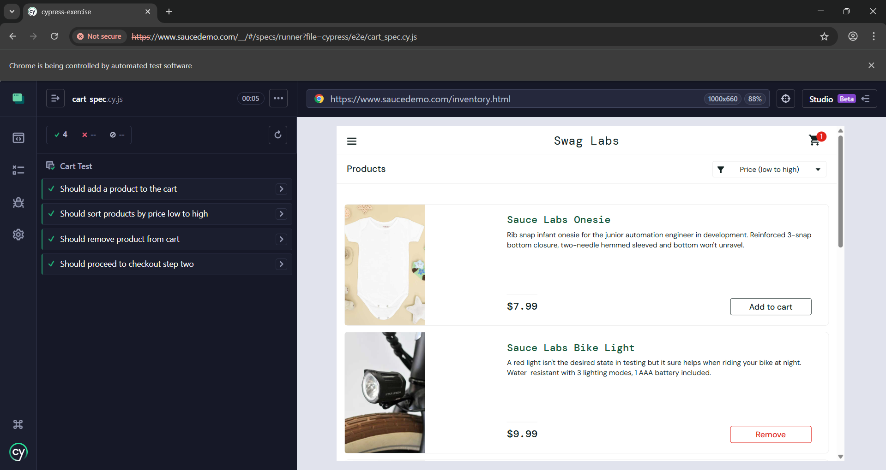

# Student Data Analysis

Dự án nhỏ minh họa cách sử dụng JUnit để kiểm thử các chức năng phân tích điểm số học sinh.

## Chức năng
1. **countExcellentStudents**: Đếm số học sinh có điểm >= 8.0 (Bỏ qua điểm < 0 hoặc > 10).
2. **calculateValidAverage**: Tính điểm trung bình của các điểm hợp lệ (0-10).

## Cấu trúc thư mục
- `src/`: Mã nguồn Java.
- `test/`: Mã nguồn kiểm thử JUnit.

## Cách chạy kiểm thử
Sử dụng IDE (IntelliJ/Eclipse) hoặc Maven/Gradle để chạy file `StudentAnalyzerTest.java`.

C3

C4

